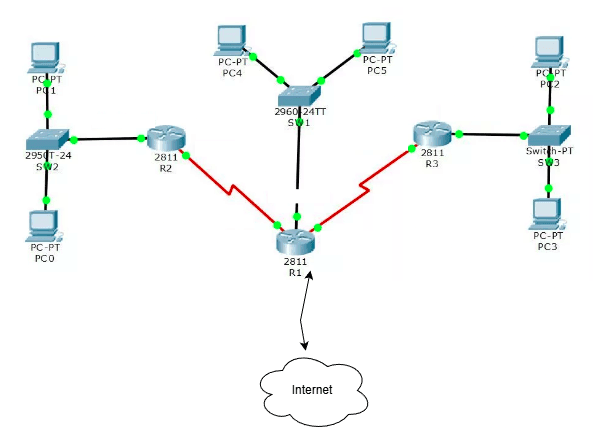

## Integrantes

* Eike Fabricio da Silva
* João Henrique Barbosa de Fernandes Alencar

## Etapas

### Etapa 1

#### Diagrama da topologia

Resumo:
- `R1` atua como gateway da rede, faz o roteamento entre as LANs e aplica NAT/firewall para acesso externo.
- `R2` atende a LAN da esquerda.
- `R3` atende a LAN da direita.
- O servidor `dhcp` fica na LAN central e atende as três sub-redes, com relay DHCP em `R2` e `R3`.

#### Tabela de enderecamento

| Segmento | Equipamento | Interface | Endereco | Mascara | Gateway | Funcao |
| --- | --- | --- | --- | --- | --- | --- |
| LAN central | `R1` | `eth0` | `192.168.1.1` | `/24` | - | Gateway da LAN central |
| LAN central | `dhcp` | `eth0` | `192.168.1.254` | `/24` | `192.168.1.1` | Servidor DHCP |
| LAN central | `pc4`, `pc5` | `eth0` | DHCP | `/24` | `192.168.1.1` | Clientes |
| Enlace R1-R2 | `R1` | `eth1` | `10.0.12.1` | `/30` | - | Roteamento entre `R1` e `R2` |
| Enlace R1-R2 | `R2` | `eth0` | `10.0.12.2` | `/30` | `10.0.12.1` | Roteamento entre `R2` e `R1` |
| LAN esquerda | `R2` | `eth1` | `192.168.2.1` | `/24` | - | Gateway da LAN esquerda |
| LAN esquerda | `pc0`, `pc1` | `eth0` | DHCP | `/24` | `192.168.2.1` | Clientes |
| Enlace R1-R3 | `R1` | `eth2` | `10.0.13.1` | `/30` | - | Roteamento entre `R1` e `R3` |
| Enlace R1-R3 | `R3` | `eth0` | `10.0.13.2` | `/30` | `10.0.13.1` | Roteamento entre `R3` e `R1` |
| LAN direita | `R3` | `eth1` | `192.168.3.1` | `/24` | - | Gateway da LAN direita |
| LAN direita | `pc2`, `pc3` | `eth0` | DHCP | `/24` | `192.168.3.1` | Clientes |

#### Faixas DHCP por LAN

| LAN | Faixa DHCP | Gateway entregue | DNS entregue |
| --- | --- | --- | --- |
| Central | `192.168.1.100-192.168.1.200` | `192.168.1.1` | `8.8.8.8` |
| Esquerda | `192.168.2.100-192.168.2.200` | `192.168.2.1` | `8.8.8.8` |
| Direita | `192.168.3.100-192.168.3.200` | `192.168.3.1` | `8.8.8.8` |

#### Plano de rotas estaticas

| Equipamento | Rota | Proximo salto | Objetivo |
| --- | --- | --- | --- |
| `R1` | `192.168.2.0/24` | `10.0.12.2` | Alcancar a LAN esquerda |
| `R1` | `192.168.3.0/24` | `10.0.13.2` | Alcancar a LAN direita |
| `R2` | `default` | `10.0.12.1` | Encaminhar trafego para outras redes e internet |
| `R3` | `default` | `10.0.13.1` | Encaminhar trafego para outras redes e internet |
| `dhcp` | `default` | `192.168.1.1` | Alcancar redes remotas e internet |

Observacao:
- O acesso a internet sai por `R1`, que aplica NAT para as redes `192.168.1.0/24`, `192.168.2.0/24`, `192.168.3.0/24`, `10.0.12.0/30` e `10.0.13.0/30`.

#### Plano de testes

1. Subir ou reiniciar o laboratorio:
   `kathara lrestart`
2. Validar leases DHCP em todas as LANs:
   `kathara exec pc0 -- ip -4 -o addr show dev eth0`
   `kathara exec pc2 -- ip -4 -o addr show dev eth0`
   `kathara exec pc4 -- ip -4 -o addr show dev eth0`
3. Forcar um novo DHCP discover e observar o processo:
   `kathara exec pc0 -- sh -lc 'dhclient -r eth0; dhclient -v eth0'`
4. Confirmar que os relays DHCP estao ativos:
   `kathara exec r2 -- sh -lc 'ps -ef | grep [d]hcrelay'`
   `kathara exec r3 -- sh -lc 'ps -ef | grep [d]hcrelay'`
5. Testar conectividade local com o gateway de cada LAN:
   `kathara exec pc0 -- sh -lc 'ping -c 2 192.168.2.1'`
   `kathara exec pc2 -- sh -lc 'ping -c 2 192.168.3.1'`
   `kathara exec pc4 -- sh -lc 'ping -c 2 192.168.1.1'`
6. Testar roteamento entre sub-redes:
   `kathara exec pc2 -- sh -lc 'ping -c 2 192.168.1.100'`
   `kathara exec pc0 -- sh -lc 'traceroute 192.168.3.100 || tracepath 192.168.3.100'`
7. Testar saida para a internet:
   `kathara exec pc0 -- sh -lc 'ping -c 2 8.8.8.8'`
   `kathara exec pc4 -- sh -lc 'ping -c 2 8.8.8.8'`

### Etapa 2

Este repositório.

### Etapa 3

### Etapa 4
